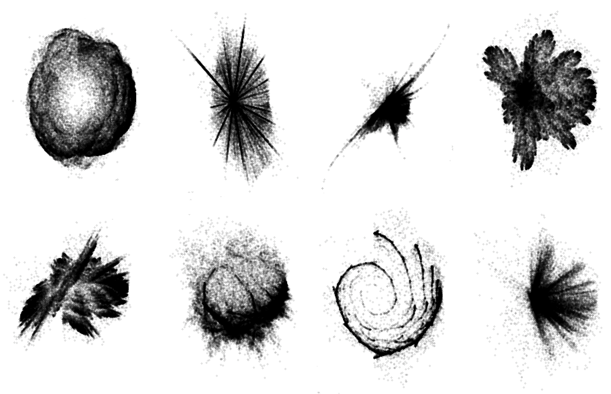

# Iterated Function Systems

## Random fractals (created using chaos games)

</img>

## IFS-based method for generating horns and seashells
Implementation of: 
<i>Stępień, C. (2009). An IFS-based method for modelling horns, seashells and other natural forms. Computers & Graphics, 33(4), 576-581.</i>

</img>